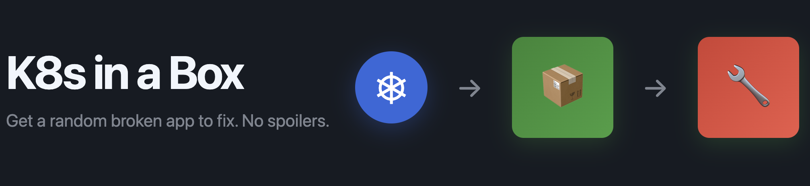

# K8s in a Box

Spin up a local Kubernetes (kind) cluster and get a **random broken app** to fix. No spoilers. Use your K8s, Linux, and networking skills to diagnose and repair.

## Prereqs

- Docker
- kind (`brew install kind` or `choco install kind`)
- kubectl (`brew install kubernetes-cli`)
- Python 3.9+

## Quickstart

```bash
# one-time
make setup

# create cluster
make cluster

# generate + deploy a randomised challenge
# DIFFICULTY: easy|medium|hard, SEED optional (shareable)
make challenge DIFFICULTY=medium SEED=424242
make challenge DIFFICULTY=easy SEED=424091
# or random
make challenge

# read the scenario brief (symptoms, acceptance criteria)
make brief

# see what's up
make status

# (optional) get a nudge without revealing answers
make hint

# after you've fixed things, verify:
make verify
## if all checks pass, you can submit your solution.
```

## To submit your solution (with evidence)

```bash
make submit

# Then send your zip.
```

## What's deployed

- Namespace: kbox
- App: nginx-unprivileged behind a ClusterIP Service
- A busybox pod net-debug for testing in-cluster connectivity
- A PVC (sometimes relevant)

## How it works

The generator injects 1–3 faults depending on difficulty. Examples:

- Service selector mismatch (no endpoints)

- Service targetPort mismatch

- Bad readiness probe path/timing

- Default-deny NetworkPolicy

- PVC won’t bind

- Missing ConfigMap key reference

You are not told which faults were used. Work the problem:

- `kubectl get pods,svc,ep -n kbox`

- `kubectl describe pod/DEPLOYMENT -n kbox`

- `kubectl logs ...`

- `kubectl exec -n kbox -it net-debug -- sh then wget -qO- app.kbox.svc.cluster.local`

- `kubectl get events -n kbox --sort-by=.lastTimestamp`

## Clean up

```bash
make reset          # delete only the kbox namespace
make clean          # delete the kind cluster and render dir

## if it gets stuck

### Delete the namespace
kubectl delete ns kbox --grace-period=0 --force

### If it gets stuck in "Terminating", patch finalizers
kubectl get ns kbox -o json | \
jq '.spec.finalizers=[]' | \
kubectl replace --raw /api/v1/namespaces/kbox/finalize -f -
```

## Troubleshooting

- Pods Pending → Read events; PVC binding; node taints.

- Service has no Endpoints → Labels/selectors mismatch.

- Readiness failing → Probe path/port; timing; 404 vs 200.

- No traffic → NetworkPolicy default-deny? DNS? Use net-debug.

## Notes

- Random seed lets instructors reproduce a scenario (SEED=12345).
- No solutions are printed; only optional generic hints.


## Still stuck?

```bash
I_AM_TEACHER=yes make answers SEED=424091 DIFFICULTY=medium
cat .teacher/answers-424242.md
```

## TODO

- Make steps more clear for newbies.
- Add more challenges.
- Add more hints.
